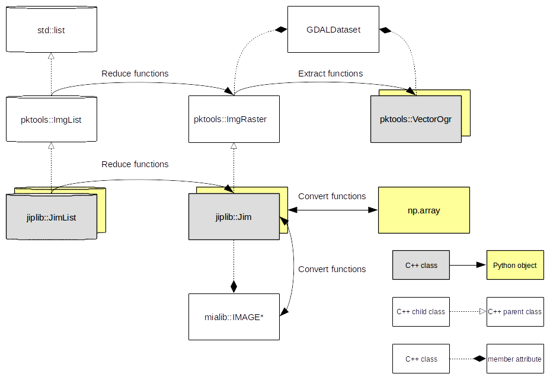

General concepts
================

.. toctree::
   :maxdepth: 4

.. py:module:: jiplib

TODO: write intro here

The main components of the library are the following software classes:

Jim:
its aim is to ... See reference manual: :py:class:`Jim`.

JimList:
is the class to use to select the data collection to browse and filter based on geographic location and metadata attributes. See reference manual: :py:class:`JimList`.

VectorOgr:
is a software representation of a processing chain (a series of processing operator applied to source data to perform a specific analysis). See reference manual: :py:class:`VectorOgr`.

In the following chapters all methods of the four classes are described.
